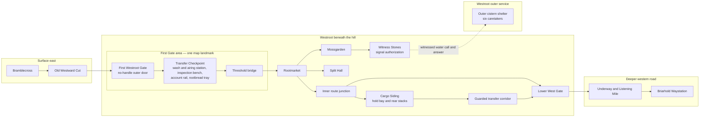

# Chapter 3 Route Diagram

Last updated: 2026-07-24

Status: Working physical-continuity reference paired with `chapter-3-story-truth.md`. This is a story-geography diagram, not a replacement for the playable Westroot tile graph.

## Physical Layout

## Route Use

### Lio and the false Willow convoy

`Bramblecross side → Old Westward Cut → First Gate → Transfer Checkpoint → Threshold bridge → Inner route junction`

The convoy waits at the checkpoint while its papers are compared. The child serves every waiting traveler from the rootbread tray; Lio returns the cup with his blue-thread knot. At the inner junction, the crate is unloaded into Cargo Siding. Lio is taken through the guarded transfer corridor and out through the Lower West Gate.

### Liam's party

`Old Westward Cut → First Gate and Transfer Checkpoint → Threshold bridge → Rootmarket and public Westroot locations`

The checkpoint is part of the First Gate interaction, not a separate map destination. The party sees it during arrival and returns after Lume names the child who served the earlier convoy. The party does not use the transfer corridor during Chapter 3. It reaches Cargo Siding through Westroot's public inner junction after Bramwell and Noma authorize the investigation.

### Outer-shelter communication

The outer cistern shelter is not reached by opening the First Gate. Its water calls travel through listening marks authorized at the Witness Stones. Closing the stone walk blocks Westroot from sending the next call and receiving the shelter's answer.

## Boundary Rules

- The **First Gate** is a guarded person-and-cargo entrance. Under normal hidden operation it opens only for a scheduled, named account confirmed from inside.
- The **Transfer Checkpoint** is the inner landing of the First Gate, with a wash basin or water channel, airing rack, inspection bench, account rail, and ordinary rootbread tray. Its sanitation procedure dates from Witherdeath. It is one map landmark with the gate and should read as a practiced routine, not a new puzzle.
- **Cargo Siding** is an interior freight store and rail spur, not the crate's proof of exit from Westroot.
- The **Lower West Gate** leads to the Underway and Lio's Chapter 4 route.
- The **Witness Stone hold-shutter** closes civic signal authorization, not every physical door in Westroot.
- The **Hold Bell order** is the later emergency action that closes the First Gate and side passages as well as listening signals.

## Map Interaction Decision

Do not add an eighth permanent Westroot landmark. Reuse the First Gate area:

- Arrival automatically introduces the checkpoint's account rail and inspection bench.
- After Lume gives the Rootbread lead, place the Mossback child's temporary map marker on the inner gate landing.
- Interacting there lets Mara inspect the returned cup, hear what happened during the Willow transfer, and help restock the rootbread tray.
- After completion, the child marker disappears and the checkpoint remains reviewable through **Inspect First Gate**.
- Retire the current `rootbread_hatch` story landmark when the playable rewrite is implemented; do not move its impossible geometry elsewhere on the map.
